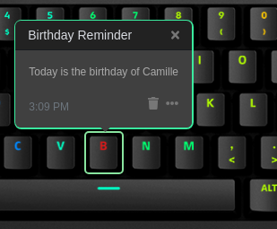

# Q Applet: Birthday Reminder

Let us remember the dates, so you can celebrate.
This applet will remind you the birthday date you don't want to forget.

[GitHub repository](https://github.com/daskeyboard/daskeyboard-applet--birthday-reminder)

## Example

The "1" key will blink and remind you the birthday of the person you entered.

## Changelog

[CHANGELOG.MD](CHANGELOG.md)

## Installation

Requires a Das Keyboard Q Series: www.daskeyboard.com

Installation, configuration and uninstallation of applets is done within
the Q Desktop application (https://www.daskeyboard.com/q)

## Running tests

Type npm test in your terminal.

## Contributions

Pull requests welcome.

## Copyright / License

Copyright 2014 - 2019 Das Keyboard / Metadot Corp.

Licensed under the GNU General Public License Version 2.0 (or later);
you may not use this work except in compliance with the License.
You may obtain a copy of the License in the LICENSE file, or at:

   http://www.gnu.org/licenses/old-licenses/gpl-2.0.txt

Unless required by applicable law or agreed to in writing, software
distributed under the License is distributed on an "AS IS" BASIS,
WITHOUT WARRANTIES OR CONDITIONS OF ANY KIND, either express or implied.
See the License for the specific language governing permissions and
limitations under the License.